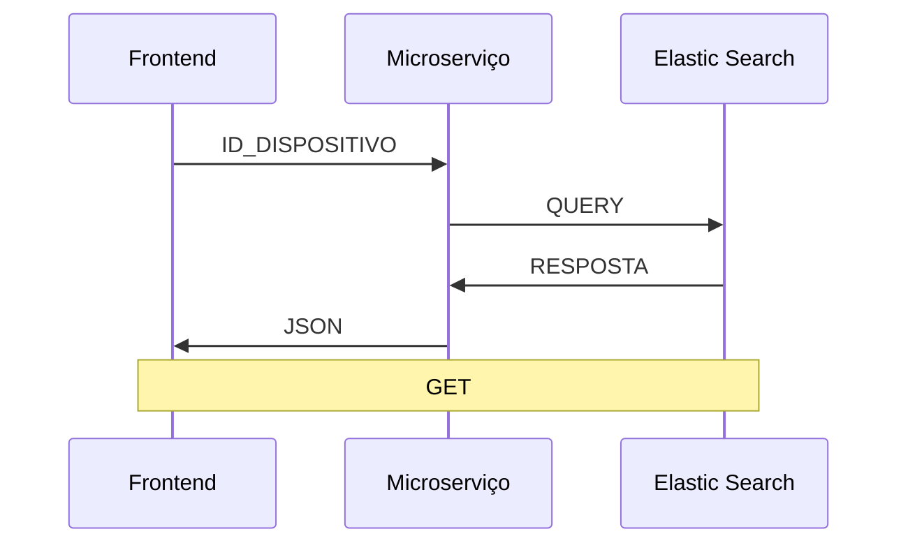
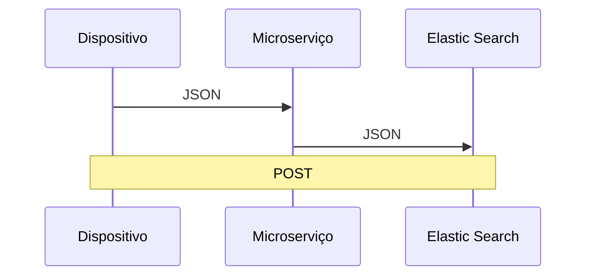
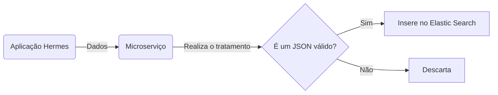

# SiMon Microserviço

Este repositório contém as aplicações, desenvolvidas no Lainf - Inmetro, que integram com sistemas de persistência de dados, como o banco de dados Elastic Search. Uma breve introdução aos serviços suportados pela microserviço pode ser encontrada abaixo, além de uma explicação sobre o funcionamento do microserviço desenvolvido.

## O que é o Elasticsearch ?

O [Elastic Search](https://www.elastic.co/pt/) é um banco de dados não relacional, de código aberto, que tem capacidade para tratar de grandes quantidades de dados em tempo real.

Desenvolvido por Shay Bannon em 2010, o servidor de buscas distribuído é baseado em [Apache Lucene](http://lucene.apache.org/core/) e desenvolvido em java, utilizando uma interface comum — JSON sobre HTTP. Ele possui clientes para as principais linguagens de programação e foi desenvolvido do zero com o objetivo de ser utilizado e distribuído em clusters. A ferramenta escalável é ideal para trabalhar com BigData.

Uma das features mais utilizadas é a **filter**, que utiliza cache para realizar buscas repetidas. Ao realizar uma busca que já foi feita antes, a ferramenta já sabe onde estão os documentos — o que garante muita velocidade para a realização de buscas por valores exatos. Já na busca por **querys**, é possível ranquear os resultados por relevância e ocasionar em mais facilidade para os usuários.

Entre as principais vantagens do Elastic Search estão a disponibilidade de dados em tempo real (near-real-time), a alta disponibilidade para tratar de grandes volumes de dados e o armazenamento de dados em forma de documentos.

## Estrutura dos dados:

|                |Elastic Search                 |MySQL                        |
|----------------|-------------------------------|-----------------------------|
|índice          |`Index`                        |Banco de Dados               |
|Tipo            |`Type`                         |Tabela                       |
|Documento       |`Document`                     |Linha/Registro               |
|Campo           |`Field`                        |Coluna                       |
|Mapeamento      |`Mapping`                      |Schema                       |
|                |`Shard`                        |Partition                    |

Ao inserir os dados no Elastic Search precisamos passar como parâmetros os seguintes termos:
 
- Index: categoriza os dados da aplicação e agrupa os tipos.
- Types: subcategoria dos dados, organiza e agrupa os documentos.
- Documents: JSON com os dados gravados. Um documento esta fisicamente dentro de um Type.

## Microserviço

Este microserviço faz parte do Sistema de Monitoramento (SiMon) desenvolvido pelo Lainf, com objetivo de coletar, armazenar e disponibilizar os dados ambientais e de acesso às dependências da Dimci, para fins de pesquisa sobre segurança em redes e dispositivos de Internet da Coisas, assim como a correlação de dados para inferir informações pertinentes ao local. Os diagramas a seguir apresentam o envio de requisições e repostas entre as aplicações do Sistema de Monitoramento. 

O microserviço consiste em uma aplicação RESTful que recebe os dados gerados por uma aplicação qualquer e realiza a persistência em um ou múltiplos bancos de dados disponibilizado(s) pelo servidor Kurose.

Para que as aplicações possam se comunicar, um serviço foi disponibilizado na porta 3004 do host, utilizando a biblioteca Flask do Python. Essa aplicação monitora a porta 3004 até receber dados em formato JSON. Após a recepção dos dados, a aplicação faz o tratamento e inserção no banco de dados identificado pela rota utilziada na URL da requisição.

A busca por informações no banco de dados é realizada através da rota `/search_data?id=<id_do_dispositivo>`, de forma que o microserviço possa executar uma busca no banco pelo dispositivo identificado na URL da requisição. O diagrama a seguir representa a troca de informações entre as aplicações durante a execução do método GET. 



A inserção de dados no Elastic Search é realizado através do método POST na rota `/insert_data`, com envio dos dados no formato JSON. A troca de dados ocorre de acordo com o diagrama apresentado a seguir.



Antes de enviar os dados para o banco, o microserviço confere se o arquivo JSON recebido se encontra em um formato válido, validando através do JSON Schema. A Figura abaixo representa o envio de dados da Aplicação Hermes para o microserviço, com posterior inserção dos dados no banco Elastic Search.



## Contêiner

O microserviço foi disponibilizado através de um contêiner, cuja imagem foi gerada através de um Dockerfile com os seguintes comandos:

```dockerfile
FROM python:3

# Atualiza timezone do container
ENV TZ=America/Sao_Paulo
RUN ln -snf /usr/share/zoneinfo/$TZ /etc/localtime && echo $TZ > /etc/timezone

# Define diretório de trabalho para /app
WORKDIR /app

# Para conectar ao conteiner que disponibiliza o serviço de Gitlab
# é necessário acessar utilziando o IP 172.17.0.X, da rede interna
# criada pelo Docker

# Instala as dependencias do projeto 
RUN pip3 install jsonschema elasticsearch elasticsearch-dsl flask flask-cors pycrypto

# Realiza o download do projeto 
RUN git clone http://172.17.0.2:80/lainf-devs/data-persistence-microservice.git
WORKDIR /app/data-persistence-microservice

EXPOSE 8079

CMD [ "python", "./main.py" ]

```

O deploy do contêiner foi realizado através do `docker-compose` com o seguinte comando:

```bash
$ sudo docker-compose up --build -d 
```

A opção `--build` é utilizada para que o Docker monte a imagem através do Dockerfile, caso a imagem ainda não exista. A opção `-d` é utilizada para realizar o _detach_ do terminal, liberando o terminal das respostas do contêiner.

O arquivo docker-compose.yml possui o seguinte conteúdo:

```yaml
services:
  dpm:
    image: lainf/dpm
    build:
      context: ./
    ports:
      - "3004:8079"
    restart: unless-stopped
    container_name: dpm-lainf
    networks:
      - es-net 

networks:
  es-net:
    external: true
```

De maneira resumida o `docker-compose` cria uma imagem que utiliza a uma imagem de base com python3, clona o repositório com o código do microserviço e instala as dependências utilizadas na aplicação. Em seguida o `docker-compose` cria um contêiner com uma instância da imagem gerada anteriormente, seguindo a estrutura indicada no arquivo docker-compose.yml.


